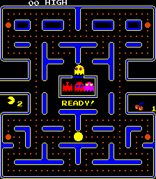
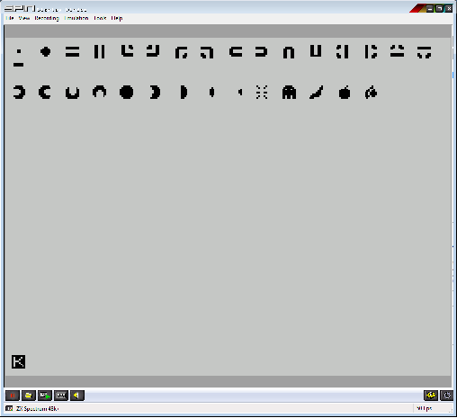
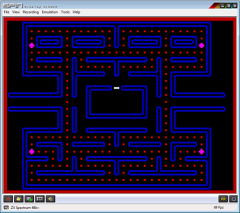
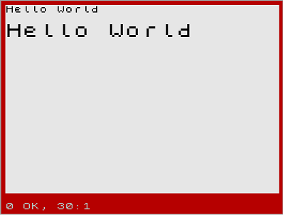
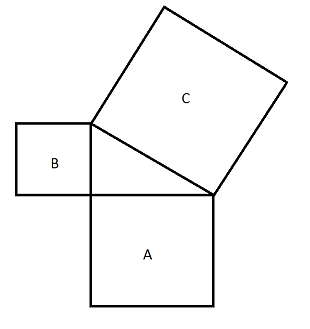

# HOWTO: ZX Basic проект с самого нуля

Это статья копия. Оригинал находится  <a href="https://docs.google.com/document/pub?id=1vUneCCC18oXLglzoRcJdrMDUSh7vaO_tGDjzjOc8IhU">здесь</a>.

Обновление : Это руководство не закончено (и никогда не будет закончено), игра вышла.

Исходный код проекта можно скачать от сюда http://www.worldofspectrum.org/infoseekid.cgi?id=0027713

## Как написать игру на Boriel ZX Basic

### Проект с нуля


So, you think you’re a competent Sinclair Basic programmer, but feel that machine code on the humble speccy is still too much for you? Is there something you can do to get basic running faster?


Luckily the answer is yes. There are a few tools out there that will help you write machine code without actually having to write the machine code, and they are called compilers.

A compiler lets you write in what’s called a high level language (BASIC is an example of a high level language), and then translates that code (programmers say it compiles it) into machine code.

You can write in a cut-down, limited version of BASIC on the spectrum, and then get it to compile your code. If you want to do this, I’d recommend using Hisoft’s BASIC compiler. It’s definitely the best one out there for general use.

You can write in C, if you know that language. There’s a cross compiler called z88dk which has been used by several people to create some good games.

The third option is a compiler called “ZX Basic”, written by Jose Rodriguez (Aka “Boriel”). He’s thinking of changing the name, partly because people get confused between ZX Basic and Sinclair Basic, and partly because he wants to extend the compiler to other computers besides the ZX Spectrum 48K.

It’s worth mentioning that you could eschew compilers altogether and write games using Jonathan Cauldwell’s excellent arcade games designers, Shoot Em Up Designer (SEUD), Platform games Designer (PGD)  and Arcade games Designer (AGD). You can think of these as games engines that need less programming, in a similar way to Quill, Graphics Adventure Creator (GAC) and Professional Adventure Writer (PAW) are games engines for text adventures.

Because this guide is targeted at Sinclair Basic users, and it’s 2012; so we ought to acknowledge there are cross-compilation tools available, I’m going to attempt to fully document a project written completely in ZX Basic. The project of choice is a simple Pac Man clone. This is not really a complex game to program, which should mean that it’s easy to follow along.

All right. Enough chat. Let’s start with the simplest Sinclair Basic Program:

```basic
10 PRINT "Hello world"
```

How would we translate that into ZX Basic, and then machine code?

Well, the ZX Basic code could be:

```basic
10 PRINT "Hello world"
```

This is going to be easy isn’t it!? Look - no differences! It’s true that ZX Basic was written with an eye to being fairly compatible with Sinclair Basic. So quite a few programs will translate across with only a small number of changes. Occasionally no changes at all.

However ZX Basic is far more powerful. It’s also capable of being used as a modern version of Basic, with many design elements deliberately made as similar as possible to FreeBasic ( http://en.wikipedia.org/wiki/FreeBASIC if you want to look that up).

For starters, Line numbers are optional, and in fact don’t have the same meaning in ZX Basic as they do in Sinclair Basic. Our program could be written without:

```basic
PRINT "Hello world"
```

ZX Basic runs from top to bottom of your basic code, just like Sinclair basic, but even without numbering the lines. If you think about it, line numbers in zx basic are for putting the code in order and for jumping to with goto, gosub and so forth. If you aren’t jumping to a line of code, why would it need a line number - especially if we can use a better editor to move code around. If you’re reading this, there’s a good chance you have a better text editor on your computer right there already (probably even if it’s just notepad).

 In fact, ZX Basic uses line numbers as labels. It doesn’t require them to be in order. It would be perfectly valid in ZX Basic, to have a program that reads:

```basic
20 PRINT "Hello ";
10 PRINT "World"
```

Sinclair Basic wouldn’t like that - it would try to reorder it. ZX Basic just goes with the flow - and it would  run from top to bottom still, printing “Hello World”. The order of the line numbers doesn’t matter - and in fact, as we’ll see later, it’s better to use more descriptive labels.

How then do we write and compile ZX BASIC? First thing, download ZX Basic from http://www.boriel.com/wiki/en/index.php/ZX_BASIC:Archive

You should download the latest version. You should also make sure you look in the forums at Jose’s website boriel.com - it’s a good place to ask questions when you get stuck. (Not If. You will get stuck! We all do!)

You can compile a zx basic program from the command line with

zxb game.bas  [Assuming your text file is called “game.bas”]

But you might make life easier by adding some options:

```sh
zxb -T -B -a game.bas
```

The `-B` option says make a BASIC loader to load the program automatically.

The `-T` option says make a TZX file, which you can load straight into an emulator.

Finally, -a says make it an autorunning file.

Why this is good is that if you have an emulator that automatically runs a .tzx, it’s a matter of just clicking on or running the file to wrap it up in an emulator and go. This makes testing your programs very quick and easy.

There are two good options for tools to make this simpler, however. The first is TommyGun, which is a retro game development environment that supports ZX Spectrum games development.

Rather than write up how to get Tommygun to play nicely with ZX Basic, I’m going to refer to the guide Boriel put together, which should be here:

http://www.boriel.com/forum/how-to-tutorials/making-zx-basic-to-work-with-tommy-gun-t329.html

The second good option is BorIDE, by Leszek Chmielewski (Aka “LCD”). This was specially designed to work as an editor for ZX Basic, and you can get it from http://members.inode.at/838331/index.html

Remember though that anything that makes a standard text file will do nicely. Linux text editors are just as great. Windows notepad is too. Though I have to recommend the editors I mention above - they can highlight the syntax for you, which makes it far easier to read.

### Designing the game.

If you’re going to write code, the most important thing you can do is begin by NOT writing code. It’s very important to think about what you are doing, and how you are going to make it work first.

For example - let’s think about the screen a bit. This is the original pac-man screen:




The first thing to notice, is that it’s the wrong way around! A spectrum runs on a TV screen that’s usually mounted wider than it is tall - in the ratio 4:3. Pac man machines had the TV turned on its side. So, how do we proceed?

Well, we can urge the player to turn the TV sideways, I suppose. But that’s not really practical. That leaves us with two practical options. We can turn the map sideways on the screen, and accept that, or we can redesign it somewhat in the constraints of our screen.

For the purposes of this guide, I have to choose one. I’m not writing a choose your own adventure here! So, we’ll redesign this to fit in 256 pixels wide, by 192 pixels high. This has been done before, and worked quite well. We’ll have to stretch it a little wider, though, and do a bit of vertical compression..

We’re going to need a memory structure for the screen display. An array will probably be fine, if we’re blocking this out. We’ll have a subroutine that displays the screen then. Backing up, before that we’ll need a subroutine that sets up our graphics!

In ZX Basic, subroutines are defined with the SUB command. They are named procedures that you can call later. They are also modules - and worth noting that they are very reusable. You can steal a sub (or a function) from another program, and it should work as a plug in item. This makes the ability to re-use code between projects far higher. In fact, in the wiki at Boriel.com, you’ll find a library of such modules that you can use in your own programs. Perhaps you’ll even want to add some of your own to it!

We also need to design some graphics. Here’s the shopping list:

- Pac Man Left view
- Pac Man Right view
- Pac Man Up View
- Pac Man Down View
- Ghost (We’ll cheat and use the same one)
- Dot
- Power Pill
- Horizontal Wall
- Vertical Wall
- Bottom Left Wall Corner
- Bottom Right Wall Corner
- Top Left Wall Corner
- Top Right Wall Corner
- Top End of Wall
- Bottom End of Wall
- Left End of Wall
- Right End of Wall
- Wall T junction Left
- Wall T junction Right
- Wall T Junction Up
- Wall T junction Down
- Ghost Box Gate

If we’re going for more detail, we’ll also need:

- Multiple frames of Pacman Dying
- Various Fruit bonuses.

That’s a lot of wall graphics! It’s also definitely going to run over the 21 graphic UDG limit. So we are going to have to be a bit clever there.

I think the smart split would be background and animated items - we don’t need to be drawing walls and pacman at the same time, so if we have two banks of UDG, we’re home free. We can swap them out by changing the UDG system variable (which says where in memory we have our UDG graphics).  

It’s much easier, in ZX Basic, to put the data into the program, and then point the UDG system variable to that location than it is to have a UDG poking loop.

Doing UDG in ZX Basic is something that I think is easier than doing it in Sinclair Basic - but there are some traps to be wary of. So, I’m going to start with a tough subject here, in the hope it will be useful to people new to ZX Basic, but who are familiar with many of the concepts, perhaps from using freebasic.

A basic program that pokes UDG from a DATA statement is hideously inefficient. First, the udg byte numbers in the data statements are stored in an inefficient way - they take up five bytes per number. Secondly, when you loop through them to poke them into the UDG area, you make yet another copy in memory - it’s in the basic program as well as in the UDG area.

Because ZX Basic is based on machine code, we can just keep the code in the native bytes format, and then point the UDG variable at it.

Which means, scary as it seems, we’re going to be doing raw machine code bytes right off. Sort of. Don’t worry - I’ll hold your hand, and it’s really quite simple when you get the hang of it.

I’m not going to teach you to design UDG. If you need help here, start with Chapter 14 of the ZX Spectrum manual:

http://www.worldofspectrum.org/ZXBasicManual/zxmanchap14.html

If I was doing this in Sinclair Basic, I’d probably do something like (for just one graphic):

```basic
10 FOR n=USR “A” to USR “A”+7
20 READ a: POKE n,a
30 NEXT n
40 DATA 0,0,0,24,24,0,0,0 : REM Dot
```

But ZX Basic doesn’t support Data statements - it doesn’t need to. It’s much more efficient at putting data into memory: Store it directly in the machine code.

We’re going to have a subroutine that sets up the UDG to be either bank 0 or bank 1 depending if we want to draw the initial maze, or draw the animated characters in it.

### Subroutines

A subroutine is defined by the reserved word ```SUB``` and lasts until we close it off with ```END SUB``` If you are familiar with named procedures (perhaps from BBC basic), it’s the same idea.

So say you wanted a hello world subroutine. You could do it like this:

```basic
SUB helloWorld ()
   PRINT “Hello World”
END SUB
```

By itself, this isn’t much of a program - it defines a subroutine, but it doesn’t run it. It’s a bit like having a ```DEF FN ``` in Sinclair basic (and we’ll talk about how ZX Basic defines functions later). It doesn’t actually run - it sets up something you call later.

The brackets are for parameters - in this case helloWorld doesn’t have any. We’ll get to that bit in a moment.

How do you actually print your hello world then? Just call the Sub by name:

```basic
helloWorld()
```

So to print Hello World a couple of times we could have, as the full program:

```basic
SUB helloWorld ()
   PRINT “Hello World”
END SUB
helloWorld()
helloWorld()
```

Isn’t that much nicer than ```GOSUB 9000``` ? ZX Basic absolutely supports Gosub and Goto, but modern programmers will frown upon using goto, and you can write absolutely any program in ZX Basic without using Goto. In a way, you’re redefining the language with your own commands.

### Parameters in Subroutines

You may have noticed that helloWorld() has a pair of brackets after it! There’s a reason for that - subroutines allow us to pass parameters. In this case, helloWorld didn’t have any, so the brackets were empty. But you can - as many as you like, as well. Here’s a pretty pointless one:

```basic
SUB printString (thingToPrint as STRING)
   print thingToPrint
END SUB
printString ("Hello World")
printString ("Hello again")
```

Hopefully that’s pretty clear - we send the sub “HelloWorld” and it gets it as variable thingToPrint, which it’s been told will arrive as a *STRING* type (we oh so will need to discuss variable types later). It takes that string, and prints it. It’s then called a second time with a different string, prints that and done. End of story.

Notice that we can use long variable names without worrying about them. Also notice we didn’t need $ at the end of the string variable name. You CAN use them if it makes you more comfortable. I tend to, actually. It reminds me that it’s a string. thingToPrint$ is a perfectly fine variable name. You don’t even have to make it a string variable, but that would be confusing!

Also notice that I can use capital letters in variable names. Writing them like that is called Camel Case - because it has “humps” - or capitals - at the start of words. It’s easier to read, programmers have found. But there’s one problem: ZX Basic insists you get the capitals right.

<mark>ThisVariable  thisvariable THISVARIABLE</mark>

It treats all those differently - as three different variables -  and you are definitely going to make that mistake. Watch out for that.

### Graphics Bank Switching

So, onto my graphics bank switching trick. It starts like this:

```basic
SUB graphicsBank (bank AS UBYTE)
IF bank=0 then
 POKE UINTEGER 23675, @graphicsbank1
ELSE
 POKE UINTEGER 23675, @graphicsbank2
END IF
```

You might even understand this straight up! In which case, well done. But there’s a heck of a lot going on here that needs to be discussed.

First, the graphicsBank sub gets a number sent to it, which it calls by variable name “*bank*”. That variable is of type “*ubyte*” - don’t worry too much about that yet (see data types, later).

After that, it has an IF statement. These are more complicated, but FAR more powerful than Sinclair Basic. An ```IF``` statement always has to be closed off with an ```END IF``` which is a big difference from Sinclair Basic, and probably the biggest change you’ll have to make if converting programs. However this means that you can make an IF multi-line, with lots of things happening if it comes out true.

There’s also an option on an ```ELSE``` clause - what to do if it’s not true.

So here the logic is “If the number I’m sent is zero, then poke the UDG system variable to point to the first graphics bank. Otherwise (```ELSE```) - that is if it’s not zero (e.g. 1) then set the UDG variable to point at the second bank. ```END IF```.

So what’s with the strange poke? And the @thingies?

POKE works almost exactly like Sinclair basic. ```POKE ADDRESS,VALUE``` works just fine - and just like Sinclair Basic, it lets you poke bytes into the Spectrum’s memory. Have you ever seen basic extensions that let you poke 2 bytes at once? Sometimes Labelled as double peek/poke (I think beta basic calls it DEEK and DOKE). That’s what this version shown does. a *UINTEGER* is another number type - in this case, a 16 bit, or 2 byte unsigned integer. It pokes the 16 bit number into 23675 and 23676 automatically.

The last part - the *@* symbols are referring to labels. **@label** means “*Address of label*” - and in this case, sets the 2 byte address marker for UDG system variable to point to the memory address of the graphics data. This means that UDG’s A-U swap between the different graphics sets.

Whew. That was a lot to explain. I hope you’re keeping up!

So where is the **UDG** data? I haven’t shown you yet. Let’s have a look at it.

Here’s the whole subroutine. Catch you on the other side.

```basic
SUB graphicsBank (bank as uByte)
IF bank=0 then POKE UINTEGER 23675, @graphicsbank1
 ELSE POKE UINTEGER 23675, @graphicsbank2
END IF
RETURN

graphicsbank1:

ASM
DEFB 000,000,000,024,024,000,000,000 ; A - Dot
DEFB 000,024,060,126,126,060,024,000 ; B - Power Pill
DEFB 000,255,255,000,000,255,255,000 ; C - Horizontal Wall
DEFB 102,102,102,102,102,102,102,102 ; D - Vertical Wall
DEFB 102,103,099,096,096,127,063,000 ; E - Bottom Left Corner
DEFB 102,230,198,006,006,254,252,000 ; F - Bottom Right Corner
DEFB 000,063,127,096,096,099,103,102 ; G - Top Left Corner
DEFB 000,252,254,006,006,198,230,102 ; H - Top Right Corner
DEFB 000,063,127,096,096,127,063,000 ; I - Left Wall End
DEFB 000,252,254,006,006,254,252,000 ; J - Right Wall End
DEFB 000,060,126,102,102,102,102,102 ; K - Wall Top End
DEFB 102,102,102,102,102,126,060,000 ; L - Wall Bottom End
DEFB 102,230,198,006,006,198,230,102 ; M - T Junction left
DEFB 102,103,099,096,096,099,103,102 ; N - T Junction Right
DEFB 102,231,195,000,000,255,255,000 ; O - T Junction Up
DEFB 000,255,255,000,000,195,231,102 ; P - T Junction Down
DEFB 000,000,000,126,126,000,000,000 ; Q - Ghost Gate
END ASM

graphicsbank2:

ASM
DEFB 000,000,000,024,024,000,000,000 ; A - Dot
DEFB 060,126,015,007,007,015,126,060 ; B - Pac-Man Left
DEFB 060,126,240,224,224,240,126,060 ; C - Pac-Man Right
DEFB 000,066,195,195,195,231,255,126 ; D - Pac-Man Up
DEFB 060,126,255,231,195,195,066,000 ; E - Pac-Man Down
DEFB 060,126,255,255,255,255,126,060 ; F - Pac-Man Closed Circle
DEFB 060,030,031,015,015,031,030,060 ; G - Pac Man Dying Frame 2 (Left is Frame 1)
DEFB 012,014,015,015,015,015,014,012 ; H - Pac Man Dying Frame 3 (50%)
DEFB 000,002,007,007,007,007,002,000 ; I - Pac Man Dying Frame 4 (25%)
DEFB 000,000,001,003,003,001,000,000 ; J - Pac Man Dying Frame 5 (12%)
DEFB 066,036,000,000,102,000,036,066 ; K - Pac Man Dying (Pop!)
DEFB 060,126,219,255,255,255,219,219 ; L - Ghost
DEFB 001,003,003,006,014,062,124,224 ; M - Banana
DEFB 002,004,030,063,063,063,063,030 ; N - Apple
DEFB 004,012,018,054,111,111,118,032 ; O - Cherries

END ASM

END SUB
```

So, the next statement is a return - that means we’ve done with the ```SUB```, and we should go back to where we came from. It works, in this case, exactly like the Sinclair Basic return statement, if you think of calling a ```SUB``` as a gosub. It can also be used to return from a gosub subroutine, of course. In this case, it goes back to the main program, right where we left off.

It works slightly differently in a function compared to a sub though (Later!).

After that return, we hide our “*machine code*”, in a place the computer won’t ever try to run it as code. It can’t get past the return statement, so it’s a safe place for data. Remember that to the computer, bytes in memory are all just numbers, and it doesn’t know which numbers are supposed to represent graphics or map or variables and such, and which are supposed to represent instructions the Z80 CPU must execute. It leaves it up to the programmer to make sure we’re not trying to run data as code. By putting the data between “```RETURN```” and “```END SUB```”, we’ve locked it into a place that should be safe from being run.

Firstly we label our first block. Labels are descriptive words with a colon  ( <mark>:</mark> ) at the end. You can use them as a gosub/goto or **@address point**. [In fact, ZX Basic actually treats line numbers as labels]

ASM means “enter assembly mode” - between an ```ASM``` and an ```END ASM``` you can actually type in assembly if you like. There’s only two things about assembly I’m going to teach you here and now: ```DEFB``` and comments.

DEFB means “define byte” - and literally means “*enter the following bytes into the machine code here*”. We’re using them here to be our graphics data. It’s sort of the equivalent of that poke command in the basic version with data statements, but the data is pre-poked!

Because labels for basic have to be “*in basic context*”, we end the first block of ```ASM```, put a label, so basic can find that point, and enter ASM again for our second block of data.

```END``` the second block, and close off the sub with an ```END SUB```.

Tada!

What do you mean you’ve tried it and it doesn’t do anything?! Well of course not. It’s a subroutine! It needs calling.

How about this as a quick test program:

```basic
CLS
graphicsBank(0)
FOR n = CODE "\a" to CODE "\q"
PRINT CHR$(n);" ";
NEXT n
PRINT
PRINT

graphicsBank(1)

FOR n = CODE "\a" to CODE "\o"
PRINT CHR$(n);" ";
NEXT n
```

What this does:

- calls our graphicsBank subroutine to set to the first bank (0)
- Does a for next loop in a manner similar to Sinclair Basic
  - Here, by the way \a is how you put “graphics character A” into a text file
  - Similarly with \q and \o
- Print out all our graphics characters. With spaces between.
-  Blank lines
-  Switch to bank 1
-  Print out all the characters from bank 1 the same way.

If you try it, (don’t forget to include the SUB it calls!) you should get something like this:



Okay. I know I’m no graphics designer. It’s not easy fitting meaningful graphics in an 8x8 grid. I know the fruit is especially awful. Shush.

I originally had solid blocks for walls, but they just looked too blocky. I borrowed from the edges of the pac-man screen up there, and they ended up as tubes. This way the walls will have edges to them. I think they look better. If you disagree, change em!

Hopefully you can see the building blocks of our maze and our characters, then.

I hope you tried it! Congratulations! A real running compiled machine code program!

### Data Types

It’s time for an aside on Data Types. This is a computer sciencey name for the different sorts of data you can have in the program - generally this means types of variables.

In Sinclair basic, you pretty much have two: *Strings* and *Numbers*. And of course arrays of those.

ZX Basic is more flexible - you can define strings, integers, floating point (numbers with a decimal point in them). Integers are the new ones - an integer is a whole number, like 3 or 4 - 3.5 would require floating point storage. The reason why they are interesting is they are MUCH faster to work in machine code - so they are a good idea to use whenever possible.

To make it more complex, there are different sizes of integer. You probably know that the basic unit of storage in a ZX Spectrum is the byte. A byte can hold a single integer from 0-255, or if it’s a SIGNED byte, from -127 to +127. Bigger numbers need to be stored in more than one byte. The smaller your data type, the faster it is to work with, and the less space it takes in memory; so you should aim to use the smallest type you can that will fit. However, be aware that if you try to put too big a number in, it won’t fit, and things may go a little strange.

Here’s the list of data types:

String: Much like Sinclair Basic - a series of characters, more or less as long as you like until you run out of memory.

|type name | desc                                          |
|--------------|--------------------------------------------------|
|UBYTE         | - Unsigned byte. Can store 0 to 255 in one byte. |
|UBYTE | - Unsigned byte. Can store 0 to 255 in one byte.         |
|BYTE  |- Signed Byte. Can store -127 to +127 in one byte.
|UINTEGER |- unsigned integer. Can Store 0 to 65,535 in two bytes.
|INTEGER |- Signed Integer - Can store -32,767 to 32,767 in two bytes.
|ULONG |- unsigned long integer - Can store 0 to 4,294,967,295 in four bytes.
|LONG |- signed long integer - Can store -2,147,483,647 to 2,147,483,647 in four bytes.
|FLOAT |- Just like Sinclair basic. Stores a floating point number in five bytes.
|FIXED |- floating point numbers, from -32767.999 to 32767.999 with less accuracy in four bytes. Is faster to work with, however. May be especially useful for screen work.

For more information on data types, see the wiki:

http://www.boriel.com/wiki/en/index.php/ZX_BASIC:Types

How do you define variables as a particular data type then? ZX Basic has extended the DIM statement for this - you DIM a variable as a type before you use it. If you don’t DIM it, ZX Basic will make assumptions about the variable - and it is likely to be wrong. Far better to define your variables first!

Full details on DIM are here:

http://www.boriel.com/wiki/en/index.php/ZX_BASIC:DIM

It’s a very complex statement, and VERY important to understanding advanced ZX Basic use. You should read that web page on it, if you read no others in the wiki.

In its simplest form ```DIM``` is used:

```basic
DIM variable AS  type
```

e.g. to define a variable called “score” as a 2-byte unsigned integer.

```basic
DIM score AS UINTEGER
```

before you use the variable “score”. It’s common for the start of the program to have variable definitions.

### Functions

This bit shouldn’t be too hard to understand if you know how the Sinclair Basic ```DEF FN ```statement works. And if you don’t - go have a look at it. It’s very useful!

In a similar way, ZX Basic lets you define functions; but, as you might guess, does it in a far more powerful way. In fact, it does it in a way that’s almost identical to subroutines defined with the ```SUB``` command.

In Sinclair basic, you can make a function like this:

```basic
DEF FN a(n)=n+1
```

This will take a parameter, call it n, and return n+1. So FN a(1) returns 2.

In ZX Basic you can do the identical thing as follows:

```basic
FUNCTION addOne(variableN as FLOAT)

   return variableN+1

END FUNCTION
```
As you now see, we can use longer and more descriptive names. We also define the parameter variables with longer, more descriptive names (though “variableN” is a bit lacking in imagination).

You can also put more than one line into the code for the function, which means you can work them that much harder - they can do anything any other piece of program code can do, such as set (global) variables, write to the screen and so on. Just like the Sinclair Basic function definition, here “variableN” is a local variable - it only exists inside this function definition.

Note the extended use of the return command, to send the final value out of the function.

### Setting up the Screen

All right. That was a lot of aside. Sorry! Hopefully you’ve got more of a feel of how ZX Basic works now.

So how are we going to setup the screen display for our munchman clone?

What we’re going to do is define an array that matches our characters on screen - we need a 32*24 array to set this up. In fact, we’re going to have two. One containing the initial screen setup, and one containing the current screen - this is important so that we can reset back to the start whenever all the dots are eaten!

This is easily done with a ```DIM``` command, of course:

```basic
DIM initialScreen(31,23) as uByte

DIM screen(31,23) as uByte
```

This sets us up with an array from 0-31 wide (32 columns, that is) and 0-23 high (which, I hope you see is 24 rows).

> **Fun fact: We can print, plot and draw to the bottom two lines of the screen as easily as the top 22!**

> **Fun fact 2: Arrays start at Zero by default in ZX Basic, though you can change this behaviour to make it work in a way more similar to Sinclair Basic.**

Right - so we have a data structure for our screen. How do we fill it in such a way that we can actually draw a maze on the screen? First things first - we have to design our screen. This is what I came up with. You might do something better - but this, I think, is about the optimum to make the same feel of maze as the original picture way uo there. It only uses 31 columns, since it needs a symmetrical vertical in the middle, so needs an odd number of columns. You can see how the graphics we designed earlier fit together to make this.

Although I did design this independently, I’ll raise a hand here, and admit I have seen CDS’s Gobble a Ghost, which looks very similar to what I came up with, but clearly their design, like this, is an interpretation of the original Pac Man I showed you above. Perhaps you can do better?


How to represent this then? Well, the simplest way I could think of, was to put the graphics number into the array - so a dot was 1, a power pill 2 and so on. I decided to make 0 a space.

That being the case, how do we put it into the array? We could have 768 LET statements, I suppose. But that would be long, wouldn’t it?

We can’t use ```READ``` and ```DATA``` - they aren’t supported (and are generally wasteful anyway, as the data ends up in memory twice - in all the data statements, and also in the variable it’s ```READ``` to).

We could use the ```ASM DEFB``` trick we used for the graphics, but arrays have another trick up their sleeve in ZX Basic - they can be DIMmed with the data in them.

To create an array, you need to define its size and type in a dim statement, as we’ve seen:

```basic
DIM familyHeights(3) as uByte
```

Would make an array of heights for up to 4 people (do you see why it’s 4 people? It starts at 0 and goes to 3).

But you can fill that immediately:
```basic
DIM familyHeights(3) as uByte => {72,60,40,34}
```

This puts the numbers straight into the array. Multidimensional arrays are a bit more complicated - you have to make it an “array of arrays” if filling directly:
```basic
DIM grid(3,2) as uByte => { {0,1,2},{3,4,5},{6,7,8},{9,10,11} } - that is four rows of three columns.
```
This might be clearer with line breaks:

```basic
DIM grid (3,2) as uByte => { _
{0,1,2},_
{3,4,5},_
{6,7,8},_
{9,10,11}_
}
```

> Notice that we can break this (and other statements) onto new lines with an underscore character. ZX Basic allows this, so that you can have multiple lines instead of one long one. It’s VERY useful for this particular case.

This means that we can express the whole maze as one array, and put it in initialScreen simply, albeit with a lot of typing:

```basic
DIM initialScreen(23,30) as uByte => { _
{00,00,07,03,03,03,03,03,03,03,03,03,03,03,03,16,03,03,03,03,03,03,03,03,03,03,03,03,08,00,00},_
{00,00,04,01,01,01,01,01,01,01,01,01,01,01,01,04,01,01,01,01,01,01,01,01,01,01,01,01,04,00,00},_
{00,00,04,01,07,03,03,08,01,07,03,03,03,08,01,04,01,07,03,03,03,08,01,07,03,03,08,01,04,00,00},_
{00,00,04,02,05,03,03,06,01,05,03,03,03,06,01,12,01,05,03,03,03,06,01,05,03,03,06,02,04,00,00},_
{00,00,04,01,01,01,01,01,01,01,01,01,01,01,01,01,01,01,01,01,01,01,01,01,01,01,01,01,04,00,00},_
{00,00,04,01,09,03,03,10,01,11,01,09,03,03,03,16,03,03,03,10,01,11,01,09,03,03,10,01,04,00,00},_
{00,00,04,01,01,01,01,01,01,04,01,01,01,01,01,04,01,01,01,01,01,04,01,01,01,01,01,01,04,00,00},_
{00,00,05,03,03,03,03,08,01,14,03,03,03,10,00,12,00,09,03,03,03,13,01,07,03,03,03,03,06,00,00},_
{00,00,00,00,00,00,00,04,01,04,00,00,00,00,00,00,00,00,00,00,00,04,01,04,00,00,00,00,00,00,00},_
{00,00,00,00,00,00,00,04,01,04,00,07,03,03,10,17,09,03,03,08,00,04,01,04,00,00,00,00,00,00,00},_
{09,03,03,03,03,03,03,06,01,12,00,04,00,00,00,00,00,00,00,04,00,12,01,05,03,03,03,03,03,03,10},_
{00,00,00,00,00,00,00,00,01,00,00,04,00,00,00,00,00,00,00,04,00,00,01,00,00,00,00,00,00,00,00},_
{09,03,03,03,03,03,03,08,01,11,00,04,00,00,00,00,00,00,00,04,00,11,01,07,03,03,03,03,03,03,10},_
{00,00,00,00,00,00,00,04,01,04,00,05,03,03,03,03,03,03,03,06,00,04,01,04,00,00,00,00,00,00,00},_
{00,00,00,00,00,00,00,04,01,04,00,00,00,00,00,00,00,00,00,00,00,04,01,04,00,00,00,00,00,00,00},_
{00,00,07,03,03,03,03,06,01,12,00,09,03,03,03,16,03,03,03,10,00,12,01,05,03,03,03,03,08,00,00},_
{00,00,04,01,01,01,01,01,01,01,01,01,01,01,01,04,01,01,01,01,01,01,01,01,01,01,01,01,04,00,00},_
{00,00,04,01,09,03,03,08,01,09,03,03,03,10,01,12,01,09,03,03,03,10,01,07,03,03,10,01,04,00,00},_
{00,00,04,02,01,01,01,04,01,01,01,01,01,01,01,00,01,01,01,01,01,01,01,04,01,01,01,02,04,00,00},_
{00,00,14,03,03,10,01,12,01,11,01,09,03,03,03,16,03,03,03,10,01,11,01,12,01,09,03,03,13,00,00},_
{00,00,04,01,01,01,01,01,01,04,01,01,01,01,01,04,01,01,01,01,01,04,01,01,01,01,01,01,04,00,00},_
{00,00,04,01,09,03,03,03,03,15,03,03,03,10,01,12,01,09,03,03,03,15,03,03,03,03,10,01,04,00,00},_
{00,00,04,01,01,01,01,01,01,01,01,01,01,01,01,01,01,01,01,01,01,01,01,01,01,01,01,01,04,00,00},_
{00,00,05,03,03,03,03,03,03,03,03,03,03,03,03,03,03,03,03,03,03,03,03,03,03,03,03,03,06,00,00}_
}
```

You may notice that I changed the array size to (23,30) - this is because the right hand edge of the screen isn’t used for maze, and it isn’t worth storing the extra spaces. Always try to save bytes if you can. Here the benefit is double - when we put it to the screen, there’s no need to process this spot, speeding it up.

How to print this up then? Here’s what I came up with:

```basic
SUB displayNewSheet()                                    
graphicsBank(0)
BORDER 2: PAPER 0 : INK 7 : BRIGHT 1
CLS
DIM y,x,currentChar as uByte
screen=initialScreen
FOR y=0 to 23
   FOR x=0 to 30
   currentChar=screen(y,x)
   BRIGHT 1
   IF currentChar=0 THEN CONTINUE FOR
   ELSEIF currentChar=1 then INK 2
   ELSEIF currentChar=2 then INK 3
   ELSEIF currentChar=17 then INK 7
   ELSE INK 1: BRIGHT 0
   END IF
   PRINT at y,x;CHR$(143+currentChar)
   NEXT x
NEXT y
END SUB
```

Obviously, displaying the sheet should be a ```SUB```. You ought to be happy with that at this stage.

We set to the correct graphics bank, and set our colours. For this test, I chose a red border, so we could see where the screen ends. For the game, matching the ```PAPER``` colour is the thing to do.

We DIM some temp local variables, so that we can track through the array, copy initialScreen to the current screen array, and then it’s a couple of ```FOR``` loops to work through it. If you’re familiar with Sinclair Basic (and you should really be, before you use ZX Basic), then this should mostly make sense.

We’re using a complicated ```IF``` statement, though. What’s with that? It’s actually not that fearsome, and even though I’ve talked about ```IF``` and ```ELSE``` before, let’s break it down. ```IF``` is one of the most important statements in the language.

We want the ```INK``` colour set, depending what character it is. The layout is:

```basic
IF currentChar=0 THEN CONTINUE FOR
```

If it’s a space, stop right here and do another loop. Continue is useful for this “abort this loop” need - you don’t need to GOTO the next statement, or have more than one next statement. This makes the program logic easier to read.

```basic
ELSEIF currentChar=1 then INK 2
```

```ELSE``` means “if the ```IF``` isn’t true” - or specifically, if the ```LAST I```F isn’t true. So we only get here if there’s ```NOT``` a space in the array at the point we are looking at. If it happens to be a dot, then we set red ink.

```basic
ELSEIF currentChar=2 then INK 3
```

If the last IF (is it a dot?) isn’t true, then processing drops down to here, and if it’s a Power Pill, we set magenta.
```basic
ELSEIF currentChar=17 then INK 7
```

Something of a corner case, here - if it’s the ghost gate, we set white. There’s only one square of this type.

```basic
ELSE INK 1 : BRIGHT 0
```

Otherwise, we set it to the wall colour.
```basic
END IF
```

Remember - all ```IF``` statements have to close with an ```END``` IF statement. Always.

If you run this, calling the displayNewSheet() sub, you’ll get the maze I showed you above. We’re well on the way to having a game! Now we just have to get some characters into it.


## Use of the ZX Basic Libraries

Well, you now have a working ZX Basic program. It doesn’t do much, but hopefully you can see how to extend it further. It’s time, I think, to talk about libraries.

In computing terms, a library doesn’t contain books, but programs - or specifically snippets of programs, that may be useful. ZX Basic has two concepts for “library routines”.

The first is inbuilt into ZX Basic and already installed on your computer, if you have ZX Basic. I’m a windows user, so my copy of the library is in

C:\Program Files (x86)\Boriel Tm\ZX Basic Compiler\library

Yours will be in a subdirectory of the Boriel compiler, regardless.

You can use functions/subroutines from this folder very easily by including them. Instead of copying the text into your main program file, you can use

```#include <filename.bas>```

For example, if you wanted to be able to use ATTR as a command, which is not inherently available in ZX Basic, you can add it with

```#include <attr.bas>```

in your code before you call it.

This adds the attr.bas file from the library folder into your code at the point you #include it, giving you access to the attr(row,column) function, as outlined in that file.

There are several Sinclair basic keywords that are not directly built into the compiler, but can be added as library functions. Specifically: attr, point, screen$ (called screen in ZX basic), and finally input - which isn’t exactly like the sinclair basic version, but close. If you ```#include <alloc.bas>``` then it has the side effect of creating some empty space for UDG’s, so you can write to the UDG space. As noted previously, this may be uncommon usage in machine code programs, however!

All the above keywords can be glued in at once by including \<sinclair.bas\> or using the command line --sinclair option.

You should have a look at the library folder. You may like what you find.

The other library source is online: http://www.boriel.com/wiki/en/index.php/ZX_BASIC:Library

This is a library of routines and functions created by users of the compiler, but have not been automatically added to the library folder. Sometimes there are updates and improvements on the inbuilt library functions (I believe, at time of writing, that some of the print routines are more up to date here, for example).

As I write this, it’s split into maths routines, text routines, graphics routines and a compression system (megaLZ - which is actually in your library folder anyway).

Here, code is quoted in full. The simplest way to include one is to create a blank text file, and copy and paste the whole routine into it. It should be a sub or function to add to your programming toolkit. Place it in the same directory as your main project file, and

```basic
#include "myfile.bas"
```

Note that including a file from the same directory requires using quotes “” not angle brackets  < \>.

You **could** put it in the main library directory, which would allow you to use < \> to include it, but that’s generally a bad idea - newer versions of the compiler may delete or overwrite this directory.

As an example, let’s copy doubleSizePrint.bas to a file. Note the camel casing.

Go to the website, select this library routine, and copy and paste the text to a file called doubleSizePrint.bas in the same folder as your main project.

Now if you add ```#include "doubleSizePrint.bas" ```at the start of your code and call it with

```doubleSizePrint (y,x,"String")```

**(Notice that it’s y,x - similar to the way print works)**

Try it!

```basic
paper 7
ink 0
CLS
print at 0,0;"Hello World"
doubleSizePrint (2,0,"Hello World")
```



### Making things faster - Binary data, compression and memory

So now you know about library routines, we can explore some more complicated ideas. If you’ve run the program, you’ll see that even though we’re using machine code, it takes a noticeable time to draw the maze to the screen. In fact, it takes just over a second, which is hardly a long time (and if this was a Sinclair basic program, it would take tens of seconds to do the same thing). But it’s still a significant delay, that interrupts the player’s experience.

Can we go faster?

Well, yes - we can cheat. Instead of laboriously going round loops drawing all the graphics, how about we copy the screen elsewhere, and just zap it straight to screen memory. We can do that in one assembly instruction, actually (LDIR is very powerful!). This would be very fast.

The downside is that a screen takes almost 7 kilobytes of memory. That’s quite a lot, when you only have 40 or so to play with in a 48K ZX Spectrum.

The compromise is to compress this data. ZX Basic has adopted the MegaLZ packer as part of the library.

The source is here: http://lvd.nm.ru/MegaLZ/ - and you’ll need to get a compressor.

So how to use this?

First, we need a compressed copy of the screen. I got this by running the program as we have it in spin, and when the screen is up using that to export a binary file of the screen. (file, save binary). Saving the screen memory from address 16384 and a length of 6912 bytes to a file, gets us our uncompressed data.

Put this file in the same directory as the megalz packer. At a command line, I used

megalz screen.bin NewMazeScreen.mlz

Which took the 6912 byte screen and compressed it to 862 bytes! (saving 87.5%).

I then added a  ```#include <megalz.bas>``` at the start, so I have the decompressor available.

Now to get the bytes in. Where to put them? Well we have an obvious spot - with the UDG, since those are already tucked into an unreachable spot at the end of the graphicsbank subroutine. I changed the back end of this routine to read:


```basic
DEFB 001,003,003,006,014,062,124,224 ; M - Banana
DEFB 002,004,030,063,063,063,063,030 ; N - Apple
DEFB 004,012,018,054,111,111,118,032 ; O - Cherries
END ASM

newScreenPacked:
ASM
incbin "NewMazeScreen.mlz"
END ASM
END SUB
```

And it was in. incbin is a command to include bytes from a file, as though it was a series of defb commands. It must be inside asm / end asm.

With that compressed screen added, we can change our displayNewSheet() sub to:

```basic
SUB displayNewSheet()                                    
BORDER 0: PAPER 0 : INK 0 : BRIGHT 1
CLS
DIM y,x,currentChar as uByte
screen=initialScreen
megaLZDepack (@newScreenPacked,16384)
INK 7
END SUB
```

We change the ink colour to black, to match the paper colour. This means that as it draws pixels to the screen, they are invisible - only revealed at the end when colour is written to the screen. Think of those early loading screens that used the same trick.

megalzdepack needs a source and a destination address to work. Source is a label - @ is used to reference a label address. Destination is obviously screen memory, which begins at address 16384.

This unpacks our screen in about 0.2 seconds, which to the player looks instant - especially with the black screen trick; so they don’t see it build up.

Let’s add a few characters to our initial screen:

```basic
SUB displayNewSheet()                                    
graphicsBank(0)
BORDER 2: PAPER 0 : INK 0 : BRIGHT 1
CLS
DIM y,x,currentChar as uByte
screen=initialScreen
megaLZDepack (@newScreenPacked,16384)
graphicsBank(2)
doubleSizePrint(10,12,"\l")
paint(12,10,2,2,5)
doubleSizePrint(10,14,"\l")
paint(14,10,2,2,3)
doubleSizePrint(10,16,"\l")
paint(16,10,2,2,4)
print at 8,15;ink 2;"\l"
print at 18,15;ink 6;"\b"
INK 7
END SUB
```

We could reiterate the production of the compressed screen to include our characters - it’s faster (and probably smaller) to just build them in, and we know they’ll always be there at the start of a new sheet. We can then take the print statements out of the displayNewSheet routine.

Sometimes, how you program is iterative loops, as well as what you program!


### Ghost behaviour - making constants

For the ghosts we need to define something to hold information about what they are doing, and where they are doing it. There are four ghosts, so a 2 dimensional array of statistics seems in order. One dimension for the ghost number, and the other for the various numbers defining the ghost behaviour. The end result is that we have a variable - let’s call it “GhostAttributes” for this example - and GhostAttributes(1,1) being, say, the direction for ghost 1, and GhostAttributes (1,2) being the speed of ghost 1 and so on. GhostAttributes (2,1) is the direction of ghost 2 etc.

If we’re making a pac man clone do it right, then obviously we have read up on the subject at places like http://home.comcast.net/~jpittman2/pacman/pacmandossier.html which describes pac man to a very very deep degree.

For the player, we’ll need to know where the character is, and where it’s trying to go (remember, if you don’t push a direction, pacman keeps right on going, so we need to know what direction we’re headed!)

An array is an obvious choice to collect this bunch of numbers:

```basic
DIM player(2) as uByte => {18,15,8} 'y,x,Direction
```

Remember, unlike Sinclair basic, the default for arrays in ZX Basic is 0..n - so a dim value of 2 gives us 3 elements - 0,1 and 2.

Notice that we filled the array already. 18.15 is the y.x co-ordinates of the player’s starting point, and I’ve defined 8 as meaning “going left”.

Speaking of directions, I decided that binary was a good way of defining directions - so, borrowing a pattern I’d remember - the cursor keys - I decided that in binary

> 1000 was left  (this is 8 in decimal)

> 0100 was down (this is 4 in decimal)

> 0010 was up (this is 2 in decimal)

> 0001 was right (this is 1 in decimal)

You’ll see later on why this can be handy.

Constants

Remembering this can be tricky, and in most places we don’t want to be thinking “was 2 up or down?” We can use some constant definitions to help with this, using the preprocessor command DEFINE.

```basic
#define  LEFT %00001000
#define RIGHT %00000001
#define    UP %00000010
#define  DOWN %00000100
```

Remember that # must be the first character on a line, and you need to put the spaces in! Also, welcome to ZX Basic’s binary format - instead of using 1,2,4,8 I put them in binary which was simpler to work out. You can use binary numbers in ZX Basic like this just by prepending them with a %symbol. The compiler will replace this binary with the right number when you compile it.

Also, just because they will be useful, let’s define a few more:

```basic
#define SCATTER 0
#define CHASE 1
#define FALSE 0
#define TRUE 1
#define SCREENDOTS 212
```

Programmers, as a convention,  tend to put such constants in capital letters, in order to differentiate them from variables. You don’t have to do this, of course - it’s just a convention, but it can be handy to help remind you what is what.

The upshot of this is that you can do it like this instead:

```basic
DIM player(2) as uByte => {18,15,LEFT} 'y,x,Direction
```
Which is much clearer, I think. You can also do things like
```basic
IF direction = LEFT THEN PRINT “Going Left.”
```

Using this sort of trick can make your code much easier to read. It becomes, if you’re really good at it (and I’m not!)  what’s called “Self Documenting Code” - that is, it’s so clear to read that comments are superfluous. There are good reasons to use descriptive variable names and constants!

The rest of the housekeeping is fairly self explanatory, I hopel
```basic
DIM ghosts(3,5) as uByte ' An array for ghost data - four sets of (y,x,direction,status,isFrightened,isHome,dotCount,speed) => {_
   {18,15,LEFT,SCATTER,FALSE,FALSE,0),_
   {12,10,LEFT,SCATTER,FALSE,TRUE,0),_
   {14,10,LEFT,SCATTER,FALSE,TRUE,0),_
   {16,10,LEFT,SCATTER,FALSE,TRUE,0)_
}
```
Ghost information works a lot like the player information - except it’s a multidimension array, because there are four ghosts. They need slightly more information too - because we need to know more about their status.
```basic
DIM score,hiScore as uLong
```
Clearly we need a variable for score and perhaps a high score as well.
```basic
DIM retVal as uByte
```
And finally, I want to define a global return value variable for functions to use - it’s actually a little bit faster to use global variables over local ones, sadly - local ones cost time to create and destroy.

If you’ve read the treatise on Pac Man design, you’ll know how ghost behaviour is put together. One of the keys to ghost behaviour is based on the distance to a specific target location. That means we need a function that gives us a value for distance between two points.

That means it’s time for Mathematics diversion! (Sorry). A lot of programming is mathematics based.

Distance calculation in cartesian coordinate systems (that is, with x and y directions) is actually based on that pythagoras formula for a right angled triangle. Remember that?

> To Quote: The Square on the hypotenuse is equal to the sum of the squares on the other two sides.



The idea is that the area of square A, added to the area of Square B is equal to the area of badly drawn square C.

$$
A^2 + B^2 = C^2
$$

$$
C= \sqrt {A^2+ B^2}
$$

This means that the length of the line C is equal to the square root of area C. If we only know A and B (height difference and length difference), then we technically need to know:

So, for a first pass we could do:

```basic
FUNCTION distance (y1 as uByte, x1 as uByte, y2 as uByte, x2 as ubyte) as uByte
A=ABS (x1-x2)  ‘ Height difference
B=ABS (y1-y2)  ‘ width difference
C=SQR (A*A + B*B)
return C
END FUNCTION
```

We might need to apply a few variable types, but the real problem here is that it’s quite a lot of maths - in particular the SQR function in the ROM is exceptionally slow. We need to be calculating this quite a lot - once for each possible new square a ghost can step into. With four ghosts, that could be sixteen runs through this distance function; which is quite bad if it’s the slow point in the code.

If you look in the library in the wiki on Boriel’s website, you’ll see there’s a faster square root code called fsqrt.bas, which is a completely accurate square root routine, and about six times faster than the ROM code. ZX Basic uses the ROM version as a default.

We don’t need this kind of multiple decimal place accuracy here, though - and there’s an even faster routine called iSqrt.bas in there that calculates the whole number answer - equivalent to INT (SQR (n)). Generally, in games programming, integer square roots will be accurate enough!

The iSqrt program runs about 50 times faster than the ROM SQR routine.

Faster still, however, is the distance.bas function. This uses some maths you quite probably didn’t learn in school unless you were a real advanced maths head - a taylor series expansion - to calculate the distance in a way that’s much faster for a computer to run. This is even faster than iSqrt - but sadly really does start to lose accuracy. Almost certainly it’s good enough, even with the few percent inaccuracy for this game, though.

The final option, is to forget square roots altogether, and just compare squared numbers. Since we want to find the shortest distance out of a set of options, that actually works just fine for this game - instead of finding the shortest line C, we find the smallest square C, and we’ll have the same end result, in effect. This is purely because we’re after relative distances - we don’t need to know exactly how far away our target is, just which of our options is nearest. If we needed to know the distance - say because we had to move something between them, or draw the distance or show a circle of effect or something (a missile? a laser blast?) then we’d need to use something that returned at least an approximate distance value.

Even without needing to do the square root, this does leave us with the problem of calculating n2 quickly, though. Even though multiplication is much faster than working out square roots, it’s still quite an expensive process on a Z80 processor, which doesn’t have multiply instructions - so adds and shifts of bits are all we have.

This is a classic case of size vs speed. It’s MUCH faster here to look up the answer in a table than to actually calculate the answer - but the table version will take up more space.

Fortunately for us, with a screen grid of only $32 * 24$ characters, and the maze constrained even inside that, we don’t need to work out the answer to anything bigger than 302. This means we can keep the lookup table fairly short, so it’s not too much space wasted to speed up this important function.

Finally, because the answer is going to be a 16 bit number ( $30*30=900$, which is bigger than the 255 we can store in one byte, or 8 bits), I’ve designed the table with a full $255*255$ ability in mind. Since $255 * 255$ is nearly as big a number as we can fit in 16 bits, and because we’ll always want to add another similar sized number to it, I’ve designed the function to output the half the value of $n^2$. It doesn’t make any real difference when comparing numbers, but lets us add two and still stay less than 65535 - which is the limit for a 2 byte number. Remember - always keep variables small, to keep them fast.

This is how you’d write such a function in ZX Basic - it returns ($n^2/2$):

```basic
FUNCTION FASTCALL fastHalfSquares (number as uByte) as uInteger
DIM tablePointer as uInteger = @halfSquaresTable
tablePointer=tablePointer+(number*2)
return PEEK (uInteger,tablePointer)
ASM
<table goes here>
END ASM
END FUNCTION
```

Notice that again, like the UDG, data (which isn’t runnable code) is protected at the end of a ```SUB``` or ```FUNCTION``` block, but after the return, so we can’t accidentally try to run it as machine code.

However, for smallest and fastest code, there’s no beating hand assembly. I know many of you won’t be machine code programmers, so you can skip this bit if it boggles your brain - but the machine code equivalent of the above table lookup function, and quite a lot faster would be (including the table this time):

```basic
FUNCTION FASTCALL fastHalfSquares (number as uByte) as uInteger

ASM
; Calculates (number^2)/2 - does this by the fastest (and most size expensive) method - lookup table.
                        ; This function arrives with "number" - a byte in register A
ADD A,A                 ; Think of this as A=A+A - that is it doubles the value in A (Because each entry in our table is 2 bytes long)
LD C,A                  ; LET C=A
LD B,0                  ; LET B=0
LD HL,halfSquaresTable  ; LET HL=address Of Table of HalfSquares.
ADD HL,BC               ; ADD the value in BC to the value in HL - means that HL is the address of the answer result.
LD A,(HL)               ; LET A=PEEK (HL)
INC HL                  ; HL=HL+1
LD L,(HL)               ; LET L=PEEK (HL)
LD H,A                  ; LET H=A
RET                     ; Return - with the answer in HL (High byte in H, Low Byte in L)

;table of (a^2)/2 - the divided by two is so a^2 + b^2 < 65536 (ie. fits in 2 bytes) in a full 256 value table.
;Since this game currently runs on character squares, we could never have a distance diff of more than 31
; so table can be shortened from the full 512 byte set.

halfSquaresTable:
DEFB 0,0 ;0^2 /2
DEFB 0,0 ;1^2 /2
DEFB 0,2 ;2^2 /2 etc.
DEFB 0,4
DEFB 0,8
DEFB 0,12
DEFB 0,18
DEFB 0,24
DEFB 0,32
DEFB 0,40
DEFB 0,50
DEFB 0,60
DEFB 0,72
DEFB 0,84
DEFB 0,98
DEFB 0,112
DEFB 0,128
DEFB 0,144
DEFB 0,162
DEFB 0,180
DEFB 0,200
DEFB 0,220
DEFB 0,242
DEFB 1,8
DEFB 1,32
DEFB 1,56
DEFB 1,82
DEFB 1,108
DEFB 1,136
DEFB 1,164
DEFB 1,194
DEFB 1,224
END ASM

END FUNCTION
```

> Notice how DEFB is used for Data again - just like with the user defined graphics. Both the assembly version, and the basic version use the same table. the assembly version cuts out any compiler overhead - and you can absolutely burst into machine code statements like that right in the middle of your ZX Basic program. This is the amazing power of ZX Basic.

### Getting things moving

Time to work on moving our main character around. We’ll need some data on keypresses then, first. This one’s pretty easy:

```basic
FUNCTION FASTCALL getLastKey() as uByte
return peek 23560


' This returns the lastK variable from the Spectrum System variables - telling us what keycode was pressed last.

END FUNCTION
```

The ZX Spectrum has a very simple way of finding out what key was pressed last - it’s in a system variable, at address 23560 - provided interrrupts (the clock and all) are running.

An aside you don’t have to read on inline machine code, then?

This function too could be streamlined a little, actually, in machine code (again, for advanced users. Don’t worry too much about this if it’s not your thing yet):

```basic
FUNCTION FASTCALL getLastKey() as uByte
'return peek 23560
' This returns the lastK variable from the Spectrum System variables - telling us what keycode was pressed last.
' The below assembly does exactly the same thing, but should be very slightly more streamlined.
' For this game remember it's important to be able to pre-select directions - so it’s not the key that’s being pressed now that’s important - it’s the direction key that was pressed last.

asm
ld a,(23560)
end asm
END FUNCTION
```

With a bit of luck this single assembly instruction is pretty clear - the return value for a uByte function is whatever is in the A register when we reach the end. In this case, it’s grabbed from the relevant memory address, and all done.

We need a function to work out what directions an object can move around the maze from its current position. This same function will be used for both the player, and the ghosts.
```basic
FUNCTION availableDirections(y as uByte,x as uByte) as uByte
retVal=0
IF screen(y,x-1) <= 2 then retVal=LEFT
END IF
IF screen(y,x+1) <=2 then retVal=retVal BOR RIGHT
END IF
IF screen(y-1,x) <=2 then retVal=retVal BOR UP
END IF
IF screen(y+1,x) <=2 then retVal=retVal BOR DOWN
END IF
return retVal
END FUNCTION
```

This is actually simpler than it looks, and perhaps more complex at the same time - since it’s using properties of binary numbers, and using bit flags.

Notice first that it’s using the retVal global variable - this is another speed optimization, given the variable is likely to be addressed several times inside the function.

Essentially, what the rest of it does is look at the square next to the co-ordinates given, and see what’s in it. If it’s a dot, a power pill, or a space, then we’re allowed to move there. If it’s something else, we’re not. Since spaces are numbered 0 in our array, dots 1, and power pills 2, if the number in the array is <=2 it’s something we can move over.

(We’ll have to revisit this, if and when we add fruit to the mix!)

retVal is first of all reset, and if we can go left, retval is made to equal the LEFT value.

But if we can go right, we can’t make retval=RIGHT - we’d lose the information about going left. Instead, the value for RIGHT is mixed in with the value for left, using a binary OR (BOR in ZX Basic parlance) function.

The trick here is that (more mathematics - this is called boolean logic, if you want to look it up):

In binary
```
0 OR 0 = 0
0 OR 1 = 1
1 OR 0 = 1
1 OR 1 = 1
```
In other words, because the different directions are in different bits, we can mix them together to form one number to send back, from 0-15 showing which of the four directions are valid.

```
%1111 (15 in decimal)would mean we could go in all four directions.
%1000 (8 in decimal) would mean left only.
% 0110 (6 in decimal) would mean we could go both up and down, but not left and right.
```
And so on.

This is a cunning way of sending back multiple items of information from a function - especially if it’s on/off flags.

One last little subroutine to explain before I show you what updatePlayer() will look like - get(). Get is a function I stole from an earlier piece of work (see what I mean about code re-use?) that waits for a keypress, then returns that keypress. It waits for you to let go of that key before ending, though. It’s not really useful for this game, except in the testing phase - because it waits for a key, it’s equivalent to making the game pause 0 until we press a key - but won’t exit immediately if one is pressed when we get there.

```basic
FUNCTION FASTCALL get() as uByte
do
loop while inkey$<>"" ' wait for no keypress
poke 23560,0
do
loop while peek 23560=0  ' wait for keypress
do
loop while inkey$<>"" ' wait for no keypress - debounce it.
return peek 23560
END FUNCTION
```

It uses an identical method of knowing what key is pressed as getLastKey - except it sets it to zero when it arrives, and waits until it’s something else before moving on. Secondly it stops dead while waiting for the key to be let go. The compiler will warn you that you’ve created empty loops - they are rather unusual. In this case we do want to do nothing while waiting, so that’s fine.

Here’s the basic layout for updatePlayer() then - it will need more, because it has to make some decisions on moving, such as “did we hit a ghost, food, or powerpill?”

But for right now, something that gets the player moving, and demonstrates the maze will be fine.

This version has hardcoded (that is it can’t be changed) the keys in for the moment, too.

```basic
sub updatePlayer()
DIM dirs,vector,keyPressed as Ubyte
REM TESTCODE
get()
REM END TESTCODE
dirs=availableDirections(player(0),player(1))
vector=player(2)
keyPressed=getLastKey()
if keyPressed=CODE "q" and dirs BAND UP then vector=UP
END IF
if keyPressed=CODE "a" and dirs BAND DOWN then vector=DOWN
END IF
if keyPressed=CODE "o" and dirs BAND LEFT then vector=LEFT
END IF
if keyPressed=CODE "p" and dirs BAND RIGHT then vector=RIGHT
END IF
IF vector=LEFT AND dirs BAND LEFT then
   print at player(0),player(1);" "
   player(1)=player(1)-1
   print at player(0),player(1);INK 6;"\b"
ELSEIF vector=RIGHT AND dirs BAND RIGHT then
   print at player(0),player(1);" "
   player(1)=player(1)+1
   print at player(0),player(1);INK 6;"\c"
ELSEIF vector=UP AND dirs BAND UP then
   print at player(0),player(1);" "
   player(0)=player(0)-1
   print at player(0),player(1);INK 6;"\d"
ELSEIF vector=DOWN AND dirs BAND DOWN then
   print at player(0),player(1);" "
   player(0)=player(0)+1
   print at player(0),player(1);INK 6;"\e"
END IF
REM Need to put the current vector back into the player's array.
player(2)=vector
end sub
```

If we call this, with a main loop of:

```basic

' Main Program Starts here
displayNewSheet()                    
' we’ll need to resetTimer()
'Main loop
do
    'update timers
    updatePlayer()
     'Update player -> Update score (can only score if we move)
        'Update player -> power pill activated
    'update ghosts
    'dead?
    'are we done?
    ' Specials like fruit etc?
    'delay until next thing to do?
loop
```

You can also see the things I’m thinking in the main loop at the moment, even though they don’t exist yet.
